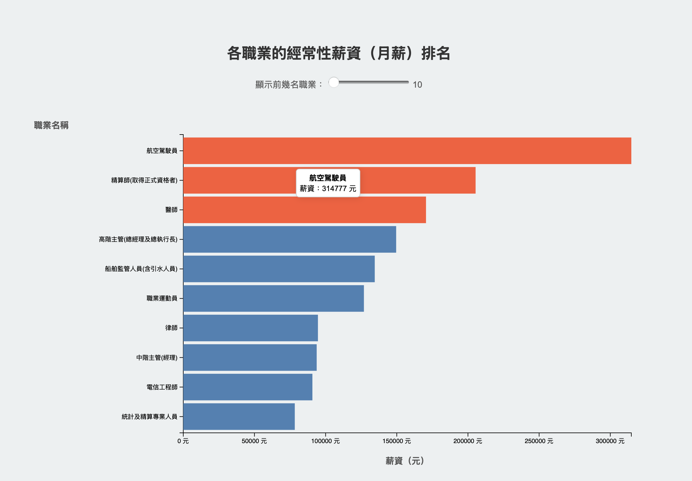
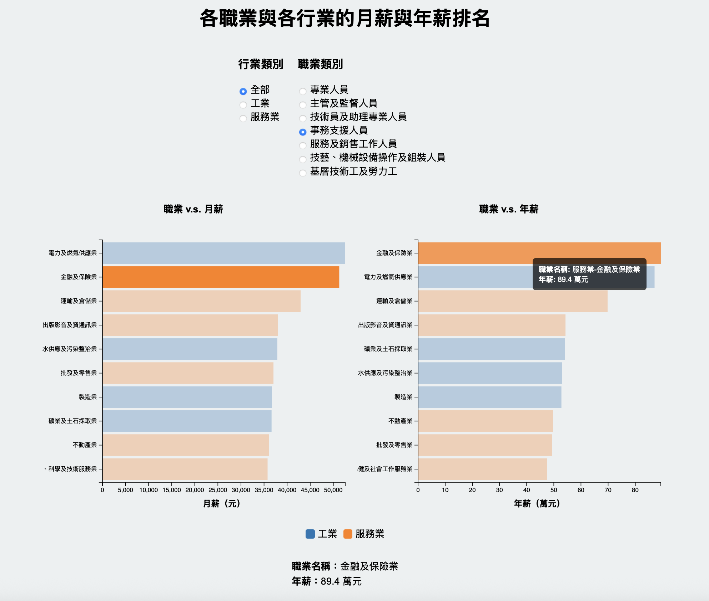
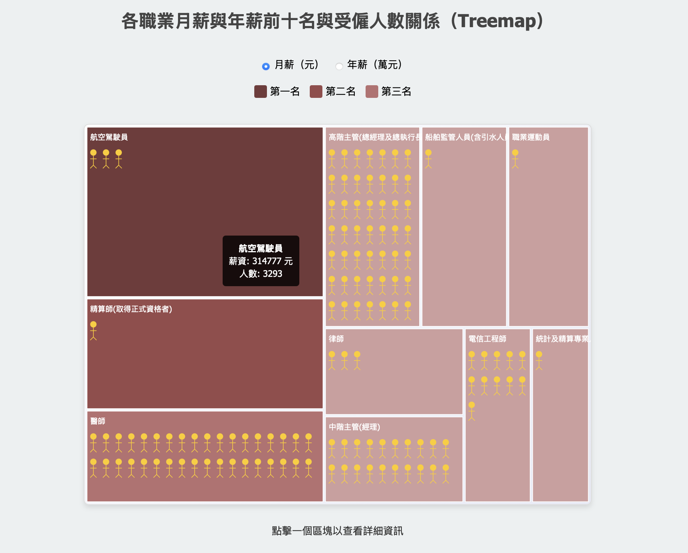
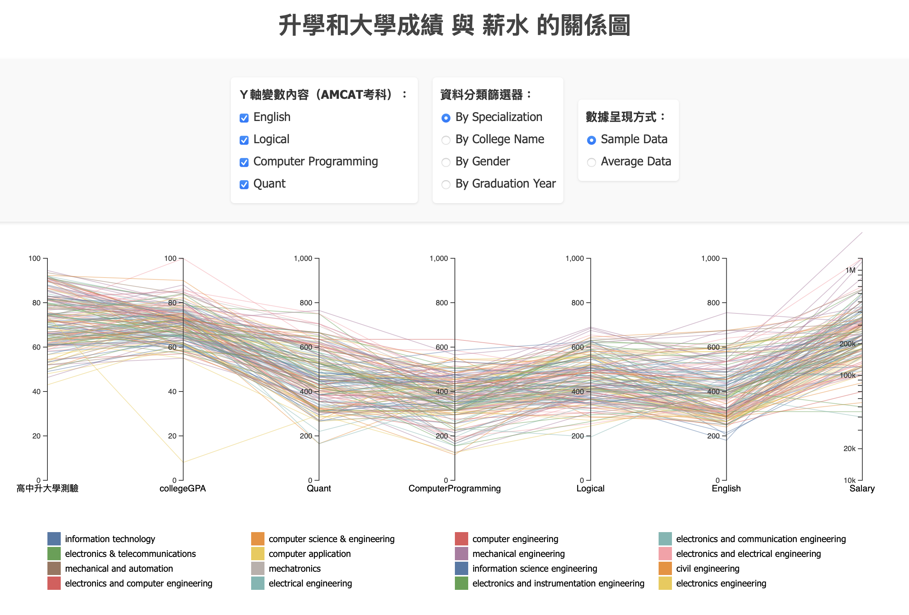
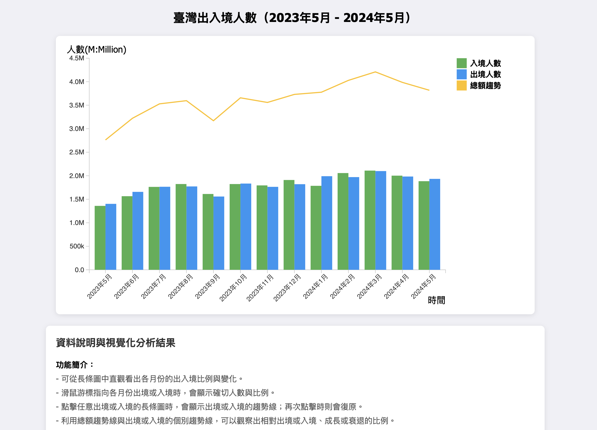

# 1131 資訊視覺化－學碩合開

> 以What角度思考資料抽象
> 以Why角度考慮任務抽象，轉化資料的領域知識以視覺化呈現。
> 以How的角度選擇最合適的表現方式。

實作部分考量演算法的效率問題，並介紹驗證視覺化有效性的方法。另外，輔以近期視覺化論文補充案例分析。

主要使用以下工具進行實作：

## 第三次作業 [Demo 連結](http://140.119.162.201:3000/homework/hw3-24/06/)

作品名稱：112年台灣薪資排名調查－經常性薪資、111年所得、受僱人數

要求：利用d3.js和目前所學將一個既有的視覺化圖表進行改良。
* 選定一新聞報導的視覺化圖表(或正式發表的文章中的圖表  如論文)
* 找到其所使用的資料集。(若無請盡可能接近可能的原始數據，這樣比較才有基準點)

實作成果，共有四部分，主要問題為以下三點：
1. 各職業經常性薪資（月薪）排名
   - 原本問題：以文字且同時敘述多筆資料的內容，夾雜許多月薪、人數等數值資料
   - 改良選擇與分析：
     - 由於是做數值上的比較，便以最直觀的長條圖作為優先考量。
     - 用水平的方式依照排名由上而下呈現，可以明顯凸出排名的重點！
     - 前三名以不同顏色作為區隔，讓閱讀新聞的人可以快速得到新聞的重點答案。
     - 增加互動工具，讓使用者可以調整呈現的數量，藉此觀看更多其他職業的薪水狀況，提升圖表的實用度。

2. 各職業與各行業的月薪與年薪排名
   - 原本問題：直接將所有行業的職業類別混再一起做討論，且以文字的方式同時敘述月薪和年薪兩項數值，較難一眼做出比較或了解排名的效果。
   - 改良選擇與分析：
     - 由於是做數值上的比較，便以最直觀的長條圖作為優先考量。
        - 因為月薪和年薪的單位差距較大，無法以組合長條圖的方式呈現。
        - 若以雙Ｙ軸（或Ｘ軸）的方式呈現，會使得月薪的結果難以辨別。
        - 最後採取左圖為月薪，右圖為年薪的方式呈現，利於比較觀察。
     - 用水平的方式依照排名由上而下呈現，可以明顯凸出排名的重點
     - 增加兩組篩選功能（職業和行業）
     - 點擊左或右某一細項時，會將左右兩側相同的細項凸顯出來，藉此容易觀察。

3. 各職業月薪與年薪前十名與受僱人數關係
   - 原本問題：無法明顯看出薪水和人數的關係，且多比數據放在一起後，無法更清楚的得知前十名彼此間的差異狀況。
   - 改良選擇與分析：
     - 使用 Treemap 的方式，在區塊內依照薪水多寡劃分。
     - 藉由顏色的深淺，僅將前三名的顏色由深至淺，其餘則以最淺的顏色呈現。用以凸顯結果。
     - 呈現人數的明顯差異，我前十名的受僱人數作為總額，再以 1000:1 的算法進行計算。
       - 以「一千人當中會有幾個人在此職業工作」的想法，呈現於各個職業的範圍當中。
      

## 第二次作業 [Demo 連結](http://140.119.162.201:3000/homework/hw2-24/111304019/)

作品名稱：升學和大學成績 與 薪水 的關係圖

要求：利用d3.js將一筆真實資料，轉換成動態的視覺化圖表呈現。

實作成果，本次主要製作為「平行座標圖Parallel coordinates」：
- 多維數據的可視化（Multivariate Data Visualization）
- 支持多維關係觀察（Observing Multivariate Relationships）
- 適合處理類別和連續型數據（Handling Both Categorical and Continuous Data）
> 以達到觀察目標：「現在薪水狀態與過去入學成績、大學GPA、和AMCAT成績關係」

動態與互動操作為：
- 選擇多個Ｙ軸的變數內容：
　－ 畫面中會固定保留「高中升大學測驗」、「collegeGPA」、「Salary」。
　－ 使用者可以自行選擇要多觀察的類別，加入新的Ｙ軸觀察數據與其的相對應關係。
- 對資料進行不同的分類：
　－ 將資料進行不同種類分類，將會呈現不同對應的顏色呈現，每種類別將帶來不同的數據與視覺變化。
　－ 當滑鼠觸碰圖例或圖表中的數據線時，只保留該組特定數據並淡化其他的數據類別，使其更易觀察。
- 調整數據的呈現方式與意涵：
　－ 提供兩種選擇來改變過多數據雜亂呈現的問題。
　－ 可以選擇Sample data，將根據你選擇的分類方式，並對其每個不同種的數據內容，分別做「10筆隨機抽樣」呈現。
　－ 可以選擇Average data，將根據你選擇的分類方式，並對其每個不同種的數據內容，分別做「計算平均」的動作，並只呈現其平均值。

## 第一次作業 [Demo 連結](http://140.119.162.201:3000/homework/hw1-24/111304019/)

作品名稱：臺灣出入境人數（2023年5月 - 2024年5月）

要求：利用d3.js將一筆真實資料，轉換成靜態的視覺化呈現放在網頁端。

實作成果，以下為互動式操作說明：
> 使用資料：中華民國內政部 > 統計報告 > 內政統計月報
- 可從長條圖中直觀看出各月份的出入境比例與變化。
- 滑鼠游標指向各月份出境或入境時，會顯示確切人數與比例。
- 點擊任意出境或入境的長條圖時，會顯示出境或入境的趨勢線；再次點擊時則會復原。
- 利用總額趨勢線與出境或入境的個別趨勢線，可以觀察出相對出境或入境、成長或衰退的比例。

